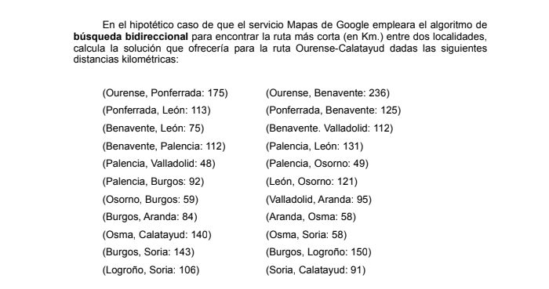
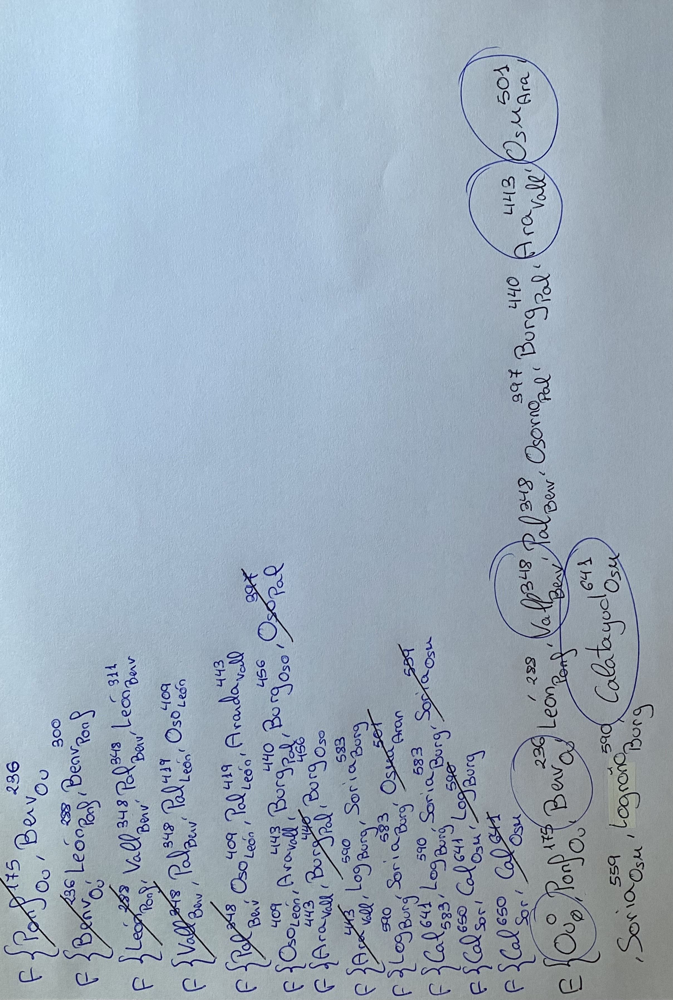

Problema:

Para abordar este problema, se ha implementado la **búsqueda de costo uniforme**. Esta estrategia de búsqueda es un método **no informado**, lo que implica que durante el proceso de búsqueda no se tiene información adicional más allá de la que proporciona la definición del problema. En este tipo de busqueda, se prioriza la expansión del nodo con el camino de costo más pequeño.

Solución:

