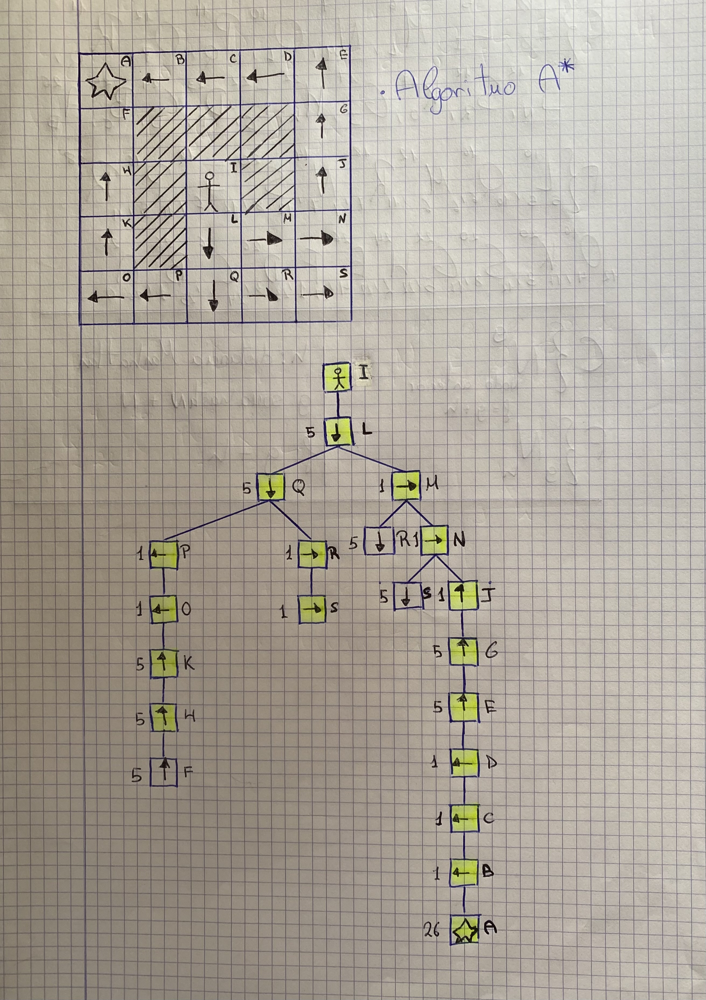
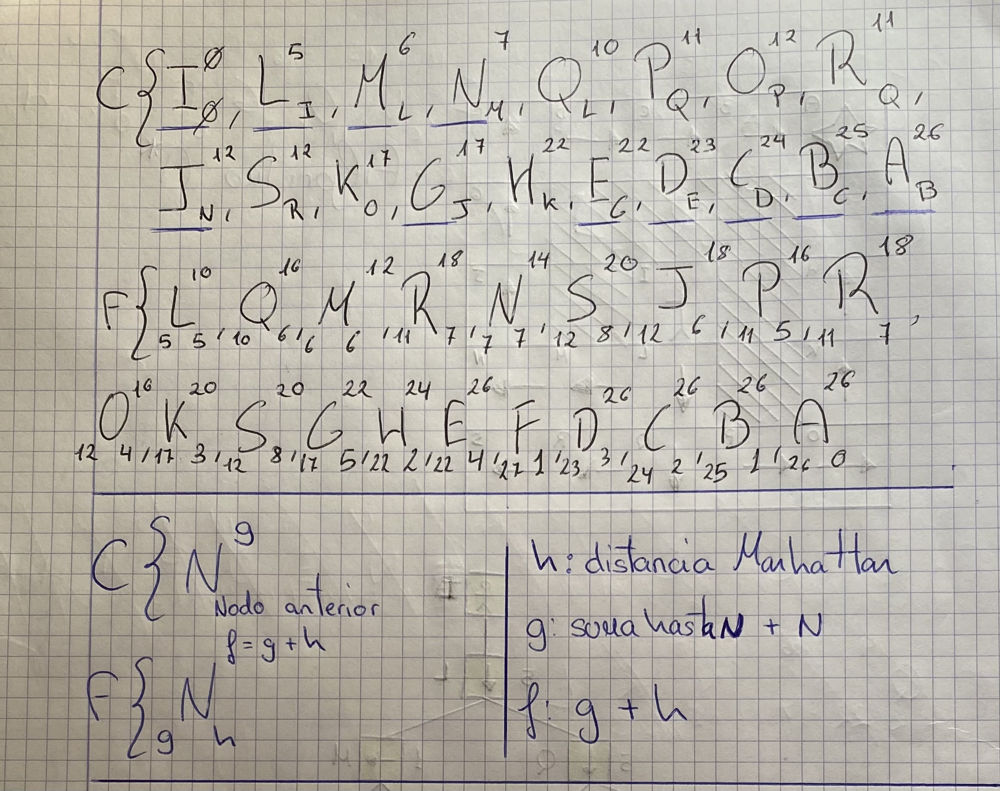

#### Solución:





#### Conclusión:

Para resolver el problema del NPC utilizando el algoritmo *A\**, se decide qué nodo se debe expandir en cada paso utilizando la distancia Manhattan (Heurística), descubriendo el camino mínimo entre el estado inicial [I] y el final [A], dando como resultado la siguiente solución:

```
S{ I(0) > L(5) > M(6) > N(7) > J(12) > G(17) > E(22) > D(23) > C(24) > B(25) > A(26)  }
```