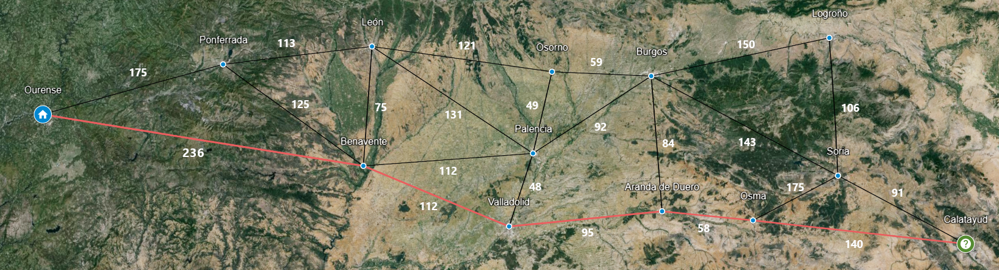

### Problema:


### Solución:




### Conclusión: 

Para resolver el problema utilizando la búsqueda de coste uniforme, se tiene como objetivo encontrar el camino de menor coste desde el nodo raíz *Ourense* hasta el nodo destino *Calatayud*. Este tipo de algoritmo garantiza la exploración de todos los nodos, priorizando aquellos con menor coste hasta alcanzar el nodo destino, dando como resultado la siguiente solución:

```
S{ Ou(0) > Benv(236) > Vall(348) > Ara(443) > Osm(501) > Calatayud(641) }
```

